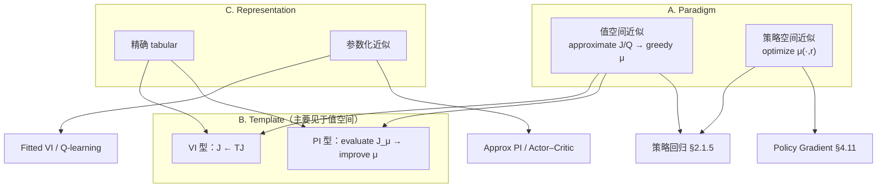

# 全书索引：算法分类、写作思路与章节安排

> **文献**：Dimitri P. Bertsekas, *Reinforcement Learning and Optimal Control*（Athena Scientific, 2019 draft）。  
> **用途**：跨 Ch.1–5 的概念索引；与各章分节笔记并列，**不替代**逐节内容。  
> **建议阅读时机**：Ch.2 章首可概览 §2–3；**系统阅读**建议在 Ch.4 §4.11 或 Ch.5 §5.7 之后。

---

## 1. 作者写作思路（Preface 归纳）

Bertsekas 在序言中将本书定位为：**在精确 DP 不可行时，通过近似构造次优但可实施、性能可接受的策略**——即强化学习、近似动态规划与神经动态规划（NDP）的统一表述。控制论（最优控制、DP）与人工智能（学习、仿真、博弈）在此交汇。

### 1.1 全书重心：值空间近似为主干

作者明确声明：**primary focus will be on approximation in value space**。核心操作始终是式 (2.1) 的结构——在有限前瞻上用 $\tilde J$（或 $\tilde Q$）截断未来，再对当前控制做优化：

```math
\tilde\mu_k(x_k) \in \arg\min_{u_k} \mathbb{E}\big\{ g_k + \tilde J_{k+1}(\cdot) \big\}.
```

策略空间近似（直接参数化 $\tilde\mu(x,r)$）是**重要补充**，适用于在线执行成本、专家模仿、策略梯度等情形；但并非全书展开的主线。

### 1.2 构造 $\tilde J$ 的四类方法（全书方法族）

序言归纳获得 lookahead 函数 $\tilde J$ 的四种典型途径（Ch.2 及后续各章分头展开）：

| 类型 | 含义 | 主要章节 |
|------|------|----------|
| **(a) 问题近似** | 解更简单的关联问题，以其最优余值作 $\tilde J$ | Ch.2 §2.3（CEC、enforced decomposition） |
| **(b) Rollout / MPC** | $\tilde J$ 取基策略 $\mu$ 的代价 $J_\mu$；常靠仿真 | Ch.2 §2.4–2.5 |
| **(c) 参数化代价近似** | $\tilde J(x,r)$ 来自线性/NN 等架构，经 LS/FVI/TD 训练 | Ch.3；Ch.4 §4.4–4.9；Ch.5 |
| **(d) 聚合（Aggregation）** | 在压缩状态空间上精确 DP，以其最优余值作 $\tilde J$ | 书中指向 [Ber12]；本 PDF 版 Ch.6 有述，笔记暂未覆盖 |

### 1.3 四条渐进式叙述轴

作者采用 **gradual expository approach**，沿四个方向由简入繁：

| 方向 | 顺序 | 体现 |
|------|------|------|
| **精确 → 近似** | 先 exact DP，再说明计算不可行性，再引入近似 | Ch.1 → Ch.2 起 |
| **有限时域 → 无限时域** | 先有限阶段（分析简洁），再平稳 MDP 理论 | Ch.1–3 → Ch.4–5 |
| **确定性 → 随机** | 确定性情形先行，且便于 rollout/MPC 阐述 | Ch.1 §1.1 先于 §1.2 |
| **Model-based → Model-free** | 先基于 $p_{ij},f,g$ 的闭式期望，再引入 MC/仿真 | Ch.2 §2.1.3 vs §2.1.4；Ch.4 §4.7 |

**Model-free 的本书定义**：期望是否用 Monte Carlo 采样估计——与「是否存在数学模型」不完全等同（见 [`ch02`](ch02-approximation-in-value-space-study-notes.md) §2.1.3 后表格）。

### 1.4 递进式引入新方法

序言：**After the first chapter, each new class of methods is introduced as a more sophisticated or generalized version of a simpler method introduced earlier.**

典型递进链：

- 精确 Bellman 反向递推（Ch.1）→ 一步前瞻 + $\tilde J$（Ch.2）→ 参数化 $\tilde J(x,r)$（Ch.3）→ 无限时域算子 $T,T_\mu$ 与 VI/PI（Ch.4）→ 仿真 + 函数逼近的 FVI / Actor–Critic（Ch.5）
- Rollout = **单次** PI（评估 $J_\mu$ + 一步改进）；PI = 重复至最优（Ch.4 §4.5、§4.6.2）
- Fitted VI = $m_k=1$ 的**乐观 PI** + 回归（Ch.4 §4.5.2）

### 1.5 数学风格与理论局限

相对 [Ber12]、[BeT96] 等专著，本书**侧重直觉阐述、证明从简**；无限时域严格证明收在 Ch.4 附录 §4.13。作者指出：许多方法在应用中有效，但**缺乏普适收敛保证**；因此需把握各类方法的计算结构与分析性质，而非仅记算法名称。

---

## 2. 全书章节组织

```
Ch.1  Exact DP（有限时域）
        │  Bellman 方程、cost-to-go、最优性原理
        ▼
Ch.2  Approximation in Value Space（有限时域次优控制）
        │  (2.1) 一步/多步前瞻；问题近似；rollout；MPC
        │  策略空间作为 §2.1.5 补充（策略回归）
        ▼
Ch.3  Parametric Approximation（架构 + 训练）
        │  线性/NN；LS、增量梯度；FVI；拟合 Q
        ▼
Ch.4  Infinite Horizon RL（理论 + 算法全景）
        │  SSP/折扣；压缩性；精确 VI/PI
        │  近似 VI、性能界、近似 PI、Actor–Critic
        │  Q-learning、TD、LP；策略梯度（§4.11 简述）
        ▼
Ch.5  Infinite Horizon Approximate Methods（大状态实现）
           FVI 细节、仿真 PI、探索/振荡、DQN、TD 族、§5.7 策略空间
```

| 章 | 标题 | 在全书中的角色 |
|----|------|----------------|
| **1** | Exact DP | 理论底座；后续近似均围绕 Bellman 结构 |
| **2** | 值空间近似 | **方法论主章**（有限时域）；值/策略两大范式在此定名 |
| **3** | 参数化近似 | 参数化架构与训练算法 |
| **4** | 无限时域 RL | 平稳 MDP 理论 + VI/PI/Q-learning 等算法族总览 |
| **5** | 无限时域近似 | Ch.4 近似方法在大状态、仿真、NN 下的实现与工程问题 |

Ch.1 §1.1.3 即在精确 DP 框架内引入值空间近似，体现「精确 → 近似」的叙述顺序。

---

## 3. 分类坐标系

值空间近似、值迭代、策略空间近似、策略迭代四个术语**不构成互斥的四分类**；其关系宜由下列三个独立维度描述：

| 维度 | 界定问题 | 取值 |
|------|----------|------|
| **A. 方法论（Paradigm）** | 主要优化或表示的对象 | **值空间**（$\tilde J/\tilde Q$ → 贪心控制） vs **策略空间**（$\tilde\mu(\cdot,r)$） |
| **B. 算法模板（Template）** | Bellman 方程的迭代方式 | **VI 型**（$J\leftarrow TJ$） vs **PI 型**（评估 $J_\mu$ → 改进 $\mu$） |
| **C. 表示（Representation）** | 值函数或策略的存储形式 | **精确**（tabular，无函数逼近误差） vs **参数化近似**（线性/NN + 回归误差） |

**维度正交性说明**：VI 与 PI 均为迭代算法；Fitted VI 与 Approximate PI 亦为迭代过程。因此「迭代」与「近似」分属不同概念层面——前者描述算法步骤的重复结构（维度 B），后者描述是否引入参数化逼近误差（维度 C），不宜将二者并列为同一分类轴。

### 3.1 结构示意



---

## 4. 核心术语界定

| 术语 | 界定 | 典型章节 | 维度组合 |
|------|------|----------|----------|
| **值迭代（VI）** | 反复应用 Bellman 最优算子 $T$ | Ch.4 §4.4 | 值空间 + VI 模板 + 精确表示 |
| **策略迭代（PI）** | 交替策略评估与策略改进 | Ch.4 §4.5 | 值空间 + PI 模板 + 精确表示 |
| **值空间近似** | 以 $\tilde J/\tilde Q$ 保留 (2.1) 结构构造次优策略 | Ch.2；Ch.4 §4.4–4.9；Ch.5 | 维度 A = 值空间；B、C 可多样 |
| **策略空间近似** | 在策略族 $\tilde\mu(x,r)$ 上直接优化或回归 | Ch.2 §2.1.5；Ch.4 §4.11；Ch.5 §5.7 | 维度 A = 策略空间 |

### 4.1 值空间近似的范围

值空间近似是**方法论层面的分类**，其内涵不限于神经网络对 $J$ 的参数化拟合，还包括：

- 问题近似、Rollout、MPC（$\tilde J$ 未必来自参数化架构）
- 直接拟合 $\tilde Q$（无需显式构造 $\tilde J$）
- FVI、Q-learning、TD、线性规划对偶等

共同特征：**控制律仍由 Bellman 型最小化（或 Q 因子的 argmin）导出**。

### 4.2 策略空间近似的两种实现

| 类型 | 做法 | 训练依赖 | 节 |
|------|------|----------|-----|
| **复合型** | 值空间求得 $\tilde\mu$ → 策略回归 $\mu(x,r)$ | 训练阶段仍依赖 Bellman/前瞻 | Ch.2 §2.1.5；Ch.5 §5.3.1 Actor 步 |
| **直接型** | $\min_r \mathbb{E}[J_{\tilde\mu(r)}]$ 或专家监督 | 轨迹代价/标签；通常不设 Critic 式 $J_\mu$ 评估环 | Ch.4 §4.11；Ch.5 §5.7 |

直接型方法**不维护** Bellman 意义下的 cost-to-go 近似 $\tilde J\approx J^*$；工程上常与 value network 并用（如 AlphaGo 类系统）。

---

## 5. 算法归属总表

| 方法 | Paradigm | Template | 表示 | 主要章节 |
|------|----------|----------|------|----------|
| 精确 VI | 值空间 | VI | 精确 | Ch.4 §4.4 |
| 精确 PI | 值空间 | PI | 精确 | Ch.4 §4.5 |
| 乐观 PI（$m_k$ 有限） | 值空间 | PI（截断评估） | 精确 | Ch.4 §4.5.2 |
| Fitted VI | 值空间 | VI | 近似 | Ch.3 §3.3；Ch.4 §4.4；Ch.5 §5.2 |
| 近似 PI / Actor–Critic | 值空间 | PI | 近似 | Ch.4 §4.6.3–4.7；Ch.5 §5.3 |
| Q-learning | 值空间 | VI（对 $Q^*$） | 近似/表格 | Ch.4 §4.8 |
| TD / LSTD / LSPE | 值空间 | 评估（PI 子步） | 近似 | Ch.4 §4.9；Ch.5 §5.4 |
| Rollout | 值空间 | PI（单轮） | 精确/启发 | Ch.2 §2.4；Ch.4 §4.6.2 |
| 一步/多步前瞻 + $\tilde J$ | 值空间 | —（在线控制） | 多样 | Ch.2 §2.1–2.2 |
| 问题近似 / CEC | 值空间 | — | 精确子问题 | Ch.2 §2.3 |
| MPC | 值空间 | Rollout 特化 | 在线优化 | Ch.2 §2.5 |
| LP 对偶 | 值空间 | VI 对偶 | 近似 | Ch.4 §4.10；Ch.5 §5.6 |
| 策略回归 | 值+策略 | PI 改进可回归 | 近似 | Ch.2 §2.1.5 |
| Policy Gradient / CEM | 策略空间 | — | 近似 | Ch.4 §4.11；Ch.5 §5.7 |
| 专家监督 (4.90) | 策略空间 | — | 近似 | Ch.4 §4.11.2 |

---

## 6. 算法间的结构关系

### 6.1 FVI 与乐观 PI

**Fitted VI = $m_k=1$ 的乐观 PI + 最小二乘回归**（Ch.4 §4.5.2）。在参数化近似情形下，VI 与 PI 并非两条完全平行的独立路线，而是同一算法族中不同的截断评估与回归组合。

### 6.2 Rollout 与 PI

**Rollout = 从基策略 $\mu$ 出发的单轮 PI**（评估 $J_\mu$ + 一步 Bellman 改进）。迭代执行即标准 PI。

### 6.3 Actor–Critic

**Actor–Critic 是近似 PI 在 RL 文献中的称谓**（Ch.4 §4.7.1）：

- **Critic**：策略评估，拟合 $J_{\mu_k}$ 或 $Q_{\mu_k}$（值空间）
- **Actor**：基于 Critic 做 Bellman 型改进，或经 §2.1.5 做策略回归（可能涉及策略空间）

Actor–Critic **不构成**与 VI/PI 并列的独立范式。

### 6.4 Q-learning 与 Q-PI

| | 对象 | 结构 |
|--|------|------|
| **Q-learning** | $Q^*$ | VI 型随机更新；无显式 $\mu_k$ 外环 |
| **Q-PI** | $Q_{\mu_k}$ | PI 型；评估 → $\arg\min_u Q$ → 更新 $\mu_{k+1}$ |

---

## 7. 概念辨析

| 命题 | 界定 |
|------|------|
| Actor–Critic 的分类 | 值空间近似 + PI 框架；Critic 拟合 $J$ 或 $Q$ |
| 策略梯度的分类 | 策略空间近似；通常不维护 $\tilde J\approx J^*$，但优化目标仍为 $J_{\tilde\mu}$，需轨迹代价估计 |
| 近似 PI 的范式归属 | 主体为值空间（Critic）；Actor 改进步可含策略回归 |
| FVI 的发散机理 | 算子 $T$ 压缩，但复合映射 $\mathcal{R}\circ T$（回归后再投影）未必压缩（例 4.4.1 / 5.2.1） |
| 近似 PI 的稳定性 | 策略代价序列 $\{J_{\mu_k}\}$ 有界；不受 FVI 中 $\tilde J_k\to\infty$ 类病理影响（Ch.4 §4.6.3） |

---

## 8. 场景与方法对照

| 需求 / 场景 | Paradigm | Template | 推荐 |
|-------------|----------|----------|------|
| 理论底座 | — | — | Ch.4 §4.1–4.3 + §4.13 |
| 小 MDP，知模型 | 值空间 | VI 或 PI | 精确 VI / PI |
| 大状态，知模型 | 值空间 | VI 或 PI | FVI、近似 PI、LP + Ch.5 |
| 仅仿真器 | 值空间 | VI 或 PI | Q-learning、TD、Actor–Critic |
| 有次优性能界 | 值空间 | 前瞻 / PI | Ch.4 §4.6（Prop 4.6.x） |
| 有启发基策略 $\mu$ | 值空间 | PI（单轮） | Rollout |
| 在线执行时延敏感 | 策略空间 | — | §2.1.5 策略回归；或直接型 PG |
| 直接优化策略参数 | 策略空间 | — | §4.11 / §5.7 PG、CEM |
| 棋类 / 深搜索 | 值空间 + 策略 | Rollout + MCTS | Ch.2 §2.4.2；AlphaGo 类 |

---

## 9. 与各章笔记的链接

| 章 | 笔记 | 与本文索引的对应 |
|----|------|----------------|
| 1 | [`ch01-exact-dp-study-notes.md`](ch01-exact-dp-study-notes.md) | 精确 Bellman；§1.1.3 引入值空间近似 |
| 2 | [`ch02-approximation-in-value-space-study-notes.md`](ch02-approximation-in-value-space-study-notes.md) | 值/策略两大范式；Rollout/MPC |
| 3 | [`ch03-parametric-approximation-study-notes.md`](ch03-parametric-approximation-study-notes.md) | 参数化工具；FVI 算法细节 |
| 4 | [`ch04-infinite-horizon-rl-study-notes.md`](ch04-infinite-horizon-rl-study-notes.md) | 精确 VI/PI；无限时域算法总览 |
| 5 | [`ch05-infinite-horizon-approximate-study-notes.md`](ch05-infinite-horizon-approximate-study-notes.md) | 大状态实现；探索与振荡 |

---

## 10. 阅读顺序

1. **Ch.1** — 建立 Bellman 方程与 cost-to-go 记号。  
2. **Ch.2 章首 + §2.1** — 值/策略两大范式；可对照本文 §2–4。  
3. **Ch.3** — 涉及 NN/FVI 实现时选读。  
4. **Ch.4 §4.1–4.5** — VI/PI 精确理论；读毕对照本文 §4–6。  
5. **Ch.4 §4.6–4.11 + Ch.5** — 近似与实现；建议通读本文。  
6. **实现或实验前** — 参照 §5 总表与 §8 场景对照。

---

*个人学习笔记；原著 Copyright Bertsekas / Athena Scientific。*
